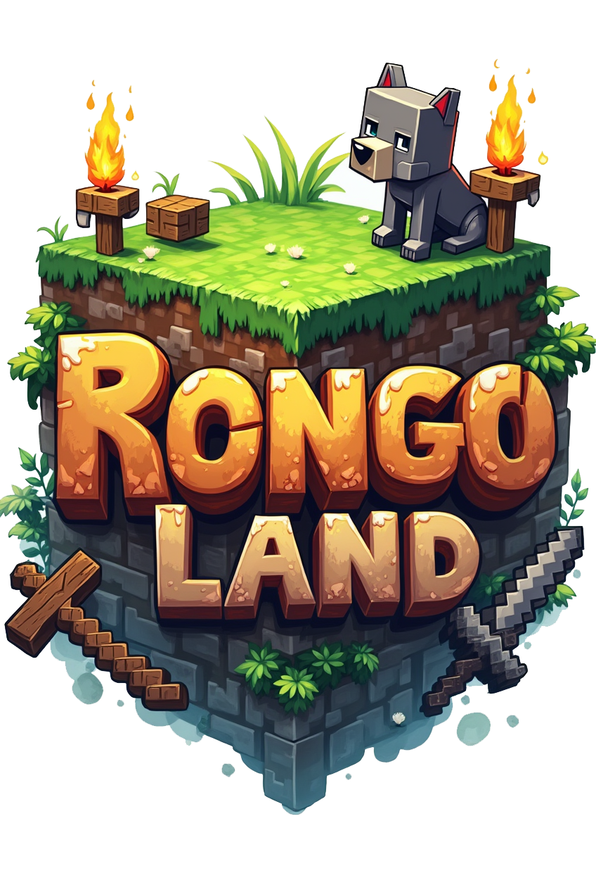

<div align="center">

# RongonLang Launcher



Lanzador personalizado para Minecraft **1.20.1 + Forge 47.4.0** con conexión automática al servidor, modpacks RAR/ZIP sin programas externos, juego preinstalado y auto-actualización.


[Join Discord](https://discord.gg/kZWQrwb64p) · [Releases](https://github.com/rongorus1/launcher-minecraft-v2/releases) · [Documentación](https://github.com/rongorus1/launcher-minecraft-v2/blob/main/README.md)

</div>

## Características

- **Juego preinstalado**: el paquete de reparto trae el juego completo dentro de `juego_preinstalado.zip`. El jugador solo descomprime y copia (1-2 min) en vez de descargar gigabytes.
- **Conexión automática**: "Play" inicia Minecraft con Forge y conecta directo al servidor.
- **Descarga robusta**: timeouts globales (15s/120s) y reintentos por archivo (`helpers/robust_network.py`). Una instalación nunca se cuelga en silencio; se reanuda y se repara automáticamente.
- **Auto-actualización**: al iniciar comprueba la última Release de GitHub; si hay una versión nueva descarga `launcher_update_<version>.zip`, lo aplica en caliente y reinicia.
- **Modpacks RAR/ZIP** sin instalar nada (usa `unrar2-cffi`, librería incluida). Quita la carpeta envolvente, coloca `mods/`, `config/`, `kubejs/`, `scripts/`, etc. directamente en `.minecraft` y solo reemplaza `mods/` si el modpack trae mods.
- **Perfiles**: inicia sesión y guarda varios perfiles con su propia configuración de RAM.

## Para jugadores

1. Descarga **`RongonLang.Launcher.zip`** (el paquete completo, incluye el juego preinstalado) y **`Rongoland.rar`** (el modpack) desde la última [Release](https://github.com/rongorus1/launcher-minecraft-v2/releases). *En la Release el nombre del zip aparece con puntos (`RongonLang.Launcher.zip`) porque GitHub convierte los espacios.*
2. Descomprímelo en cualquier carpeta y ejecuta `RongonLang Launcher.exe`.
3. Una vez, pulsa **Actualizar mods** y selecciona `Rongoland.rar` para instalar los mods.
4. Inicia sesión, configura la RAM (4-16 GB) en **Configuración RAM** y pulsa **Play**.
5. Si sale un aviso de actualización, acepta: el launcher se actualiza solo.

## Requisitos

- **Java 17**: el lanzador puede descargarlo automáticamente si no lo tienes.
- El juego ya viene preinstalado; no necesitas instalar Minecraft ni Forge por separado.

## Para desarrolladores

- Python 3.10 o superior.
- Dependencias: `pip install -r src/requirements.txt`.

```sh
python src/main.py
```

### Configuración

Edita `src/config/__init__.py` (versiones de Minecraft/Forge, servidor, nombre del launcher) y `src/version.py` (versión actual del launcher y repositorio de Releases).

### Estructura

```
src/
├── main.py                  # Punto de entrada
├── config/                  # Configuración (versiones, servidor, etc.)
├── version.py               # Versión del launcher y repo de releases
├── components/              # Componentes de UI (botones, barras, ...)
├── views/                   # Ventanas (principal, RAM, sesión)
├── controller/              # Lógica de Minecraft, sesión, actualización
├── helpers/                 # Utilidades (red, RAR/ZIP, Java, actualizador)
└── services/                # Servicios (logging, perfiles, ajustes)
```

### Empaquetar (crear el paquete para repartir)

```bat
build.bat
```

Compila directamente en `dist/distribucion/` (el ÚNICO lugar con el ejecutable) y genera:

- `RongonLang Launcher\` → ejecutable + `_internal\` + `juego_preinstalado.zip` (~849 MB)
- `Rongoland.rar` + `INSTRUCCIONES.txt`
- `launcher_update_<version>.zip` + `version.json` → para subir a la Release de GitHub

Para el archivo único de reparto: `python comprimir_paquete.py` (crea `RongonLang Launcher.zip`, ~884 MB, con el zip del juego sin comprimir dentro para extracción rápida y **sin** el modpack, que se entrega aparte).

Scripts de empaquetado:

- `empaquetar_juego.py` → genera `juego_preinstalado.zip` (versiones, librerías, assets, runtime Java).
- `empaquetar_actualizacion.py` → genera `launcher_update_<version>.zip` (solo código: exe + `_internal`, sin el juego).

### Publicar una actualización

1. Bump de versión en `src/version.py`.
2. `build.bat` (genera el nuevo `launcher_update_*.zip`).
3. Crear una Release en GitHub con tag `v<version>` y subir el `launcher_update_*.zip` como asset.

## Contribuciones

Lee [CONTRIBUTING.md](CONTRIBUTING.md) antes de abrir un issue o un PR. Reporta problemas de seguridad en [SECURITY.md](SECURITY.md). Todo el proyecto sigue el [Código de Conducta](CODE_OF_CONDUCT.md).

## Licencia

[MIT](LICENSE)

## Créditos

- [minecraft-launcher-lib](https://github.com/JakobDev/minecraft-launcher-lib)
- [CustomTkinter](https://github.com/TomSchimansky/CustomTkinter)